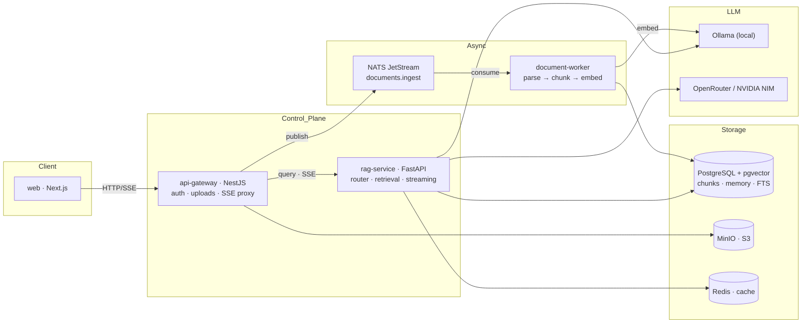

<div align="center">

# 🐵 Smoke Monkey

### Chat LLM with **super memory** & **dynamic visual** widgets

A production-grade AI chat platform that remembers every conversation across
sessions, routes each question through the smartest retrieval path, and renders
**live animated diagrams** right inside the chat — all with page-level
citations.

[](https://github.com/RajdeepDevelopment/smoke-monkey)
[](LICENSE)
[](#contributing)
[](CONTRIBUTING.md)

---


</div>

---

## ✨ What makes Smoke Monkey special

| Capability | What it does |
|---|---|
| 🧠 **Super memory** | Every exchange is embedded into a vector store and durable user facts (preferences, projects) are extracted into a long-term profile. It **answers as if it already knows you** — never announcing that it consulted a memory store. |
| 🎨 **Dynamic visual** | The LLM can drop **animated canvas widgets** into the answer stream — flowcharts, sorting demos, algorithm walkthroughs — rendered live, sandboxed, in the chat. |
| 🗂️ **Document RAG** | Upload PDFs; ask natural-language questions; get streamed answers with `[n]` **page-level citations**. |
| 🧭 **Agentic query router** | An LLM router decides per message between **knowledge base**, **conversation memory**, **live web**, or **plain chat**. |
| 🔎 **Hybrid retrieval** | Dense (pgvector) + sparse (Postgres FTS) fused with **RRF**, refined with cross-encoder **reranking**, HyDE and multi-query expansion. |
| 🔐 **User-owned keys** | Users can plug in their own OpenRouter/NVIDIA keys — encrypted at rest (AES-256-GCM) and cached in Redis. |

## 🧩 Tech stack

| Layer | Technologies |
|---|---|
| Frontend |    |
| Backend |     |
| Data & AI |     |
| Messaging & Storage |   |
| Infra |    |

## 🏗️ Architecture at a glance



## 🚀 Quick start

Requires Docker + Docker Compose (~8 GB free disk for local models).

```bash
cp .env.example .env        # configure providers (or use local Ollama)
make up                     # build & start the full stack
docker compose logs -f ollama   # wait for model pulls (first run)
make seed-user              # demo account: demo@rag.local
make web                    # open http://localhost:3001
```

Then: sign in → **Knowledge Base** → upload a PDF → wait for `ready` →
**Chat** → ask away. Answers stream in with sources.

### Ports

| Service | URL |
|---|---|
| Web app | http://localhost:3001 |
| API gateway | http://localhost:3000 |
| rag-service | http://localhost:8000 |
| Ollama | http://localhost:11434 |
| MinIO console | http://localhost:9001 |
| NATS monitor | http://localhost:8222 |
| Postgres | localhost:5432 |
| OmniRoute gateway (optional) | http://localhost:20128 |

### ⚡ Free OmniRoute gateway (optional)

Smoke Monkey can chat with **100+ free, keyless models** through the
local [OmniRoute](https://github.com/diegosouzapw/OmniRoute) OpenAI-compatible
gateway — no API key required. When enabled it is also used as the
**automatic fallback** if your OpenRouter or NVIDIA key runs out of
credits, with an in-chat notice explaining why.

```bash
# 1. Start the OmniRoute gateway on port 20128 (see its README),
#    or from Docker:
#      docker run -d --name omniroute --restart unless-stopped \
#        -p 20128:20128 -v omniroute-data:/app/data \
#        diegosouzapw/omniroute:latest
# 2. Enable the feature flag (default off) in both service env files:
OMNIROUTE_ENABLED=true
# 3. Sign in → Settings → "Free OmniRoute gateway" → enable
# 4. In Chat → "Free mode" to browse the keyless models
```

- `OMNIROUTE_BASE_URL` defaults to `http://localhost:20128/v1`
  (use `http://host.docker.internal:20128/v1` when the gateway runs in Docker
  and the services run on the host).
- The default model is `auto` — smart keyless routing. Free model namespaces
  include `oc/…`, `felo/…`, `lc/…` and `groq/…` (e.g. `groq/llama-3.3-70b`).
- See [`apps/rag-service/.env.example`](apps/rag-service/.env.example) and
  [`apps/api-gateway/.env.example`](apps/api-gateway/.env.example) for the full
  `OMNIROUTE_*` option list.

## 📚 Documentation

- **[Architecture](docs/architecture.md)** — system overview, data flow, SSE contract
- **[Hybrid retrieval flow](docs/retrieval-flow.md)** — retrieval algorithm with mermaid + canvas specs
- **[Super memory](docs/super-memory.md)** — conversation memory & durable user-fact algorithm
- **[Dynamic visual widgets](docs/dynamic-visual.md)** — the `canvas` add-on system
- **[Contributing](CONTRIBUTING.md)** · **[Security](SECURITY.md)** · **[Code of conduct](CODE_OF_CONDUCT.md)**

## 🗂️ Project structure

```
smoke-monkey/
├── apps/
│   ├── api-gateway/        NestJS — auth, uploads, chat SSE, health
│   ├── rag-service/        FastAPI — query pipeline, retrieval, streaming
│   ├── document-worker/    async PDF ingestion (parse → chunk → embed → index)
│   └── web/                Next.js — chat + documents + canvas renderer
├── packages/               shared TS contracts / config
├── infrastructure/         docker, k8s, helm, terraform
└── docs/                   architecture + algorithm docs (mermaid)
```

## ⚙️ Key configuration

| Variable | Default | Purpose |
|---|---|---|
| `LLM_PROVIDER` | `openrouter` | `ollama` / `openrouter` / `nvidia` / `gemini` |
| `ROUTER_ENABLED` | `true` | agentic query router |
| `MEMORY_ENABLED` | `true` | conversation memory embeddings + fact extraction |
| `MEMORY_TOP_K` | `5` | memory hits injected into the answer prompt |
| `WEB_SEARCH_ENABLED` | `false` | live web context (DuckDuckGo, no key) |
| `JWT_SECRET` | `change-me-in-production` | **set a real secret** |

See [`.env.example`](.env.example) for the full list. **Never commit your `.env`.**

## 🤝 Contributing

Contributions of all kinds are welcome. See [CONTRIBUTING.md](CONTRIBUTING.md)
for the workflow, code standards, and the **secret-handling policy**. Pre-commit
hooks (gitleaks + detect-secrets) block secrets from entering git history.

## 📄 License

**Non-commercial.** This project is licensed under the
[PolyForm Noncommercial License 1.0.0](LICENSE) — you may use, modify, and
distribute it for **noncommercial purposes** (research, education, personal
projects, nonprofits). Commercial use requires a separate license from the
maintainer.
